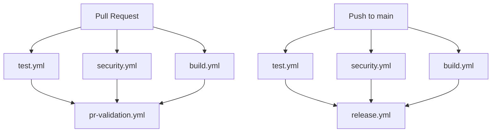

# GitHub Workflows Documentation

This repository uses a modular approach to CI/CD with separate workflows for different concerns. Each workflow is designed to be focused, maintainable, and reusable.

## Workflow Overview

### 🧪 [`test.yml`](workflows/test.yml) - Testing & Quality Assurance

**Triggers:** Push to `main`, Pull Requests  
**Purpose:** Comprehensive testing across multiple Node.js versions

- **Matrix Testing:** Node.js 20, 22, 24
- **Type Checking:** TypeScript validation
- **Code Quality:** ESLint linting and Prettier formatting
- **Test Execution:** Unit and integration tests with Vitest
- **Coverage Reporting:** Codecov integration

### 🔒 [`security.yml`](workflows/security.yml) - Security Scanning

**Triggers:** Push to `main`, Pull Requests, Monthly on Sundays at 2 AM UTC  
**Purpose:** Vulnerability detection and dependency security

- **Multi-Tool Scanning:** pnpm audit, OSV-Scanner, and Trivy for comprehensive coverage
- **Dependency Review:** License and security analysis for PRs
- **Code Scanning:** SARIF uploads to GitHub Security tab
- **Scheduled Scans:** Monthly security checks

### 🏗️ [`build.yml`](workflows/build.yml) - Package Building

**Triggers:** Push to `main`, Pull Requests, Workflow Call  
**Purpose:** Package compilation and artifact management

- **Build Verification:** Ensures package builds successfully
- **Artifact Storage:** Stores build outputs with SHA-based naming
- **Size Analysis:** Reports package size metrics
- **Release Preparation:** Creates artifacts for potential publishing

### 🚀 [`release.yml`](workflows/release.yml) - Release Management

**Triggers:** Push to `main`, Manual Dispatch  
**Purpose:** Automated releases and NPM publishing

- **Release Please:** Conventional commit-based releases
- **NPM Publishing:** Automated package publishing
- **Release Assets:** GitHub release with build artifacts
- **Production Environment:** Protected publishing environment

### ✅ [`pr-validation.yml`](workflows/pr-validation.yml) - PR Orchestration

**Triggers:** Pull Requests  
**Purpose:** Coordinates and validates all PR checks

- **Status Orchestration:** Waits for all workflows to complete
- **Validation Summary:** Provides clear PR readiness status
- **Failure Reporting:** Details which checks failed
- **Branch Protection:** Single status check for branch rules

## Workflow Dependencies

## Branch Protection Rules

Configure these status checks as required for branch protection:

- `Test & Lint` (from test.yml)
- `Security Scan` (from security.yml)
- `Build Package` (from build.yml)
- `Pull Request Validation` (from pr-validation.yml)

## Environment Setup

### Required Secrets

- `NPM_TOKEN` - NPM publishing token
- `CODECOV_TOKEN` - Code coverage reporting token

### Required Environments

- `production` - For NPM publishing (optional but recommended)

## Dependabot Integration

Dependabot is configured in [`dependabot.yml`](dependabot.yml) to automatically:

- **NPM Dependencies:** Weekly updates grouped by category
- **GitHub Actions:** Weekly updates grouped by functionality
- **Smart Grouping:** Related packages updated together
- **Auto-assignment:** PRs assigned to maintainers

## Benefits of This Structure

### 🎯 **Focused Responsibilities**

- Each workflow has a single, clear purpose
- Easier to debug and maintain individual workflows
- Faster iteration on specific functionality

### 🔄 **Parallel Execution**

- Test, security, and build workflows run in parallel
- Faster feedback for pull requests
- Efficient resource utilization

### 🛡️ **Security & Reliability**

- Separate security scanning with daily schedules
- Protected release environment
- Comprehensive dependency monitoring

### 📊 **Clear Status Reporting**

- Individual status checks for each concern
- Aggregated validation status for PRs
- Detailed failure reporting

### 🔧 **Easy Maintenance**

- Modular workflows are easier to update
- Dependabot keeps actions and dependencies current
- Clear documentation for team members

## Troubleshooting

### Workflow Failures

1. Check individual workflow logs for specific errors
2. Review PR validation summary for quick overview
3. Ensure all required secrets are configured

### Dependency Updates

1. Dependabot PRs are automatically created weekly
2. Review grouped updates for compatibility
3. Test changes thoroughly before merging

### Release Issues

1. Verify conventional commit format in commits
2. Check that all required workflows pass
3. Ensure NPM_TOKEN has publishing permissions
